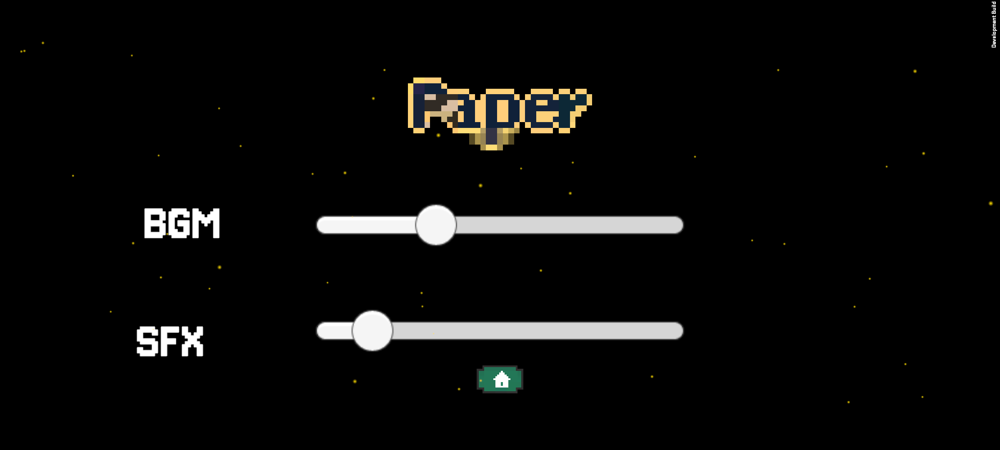

# Heart Of The Totem 

## Description

Heart of the Totem is my second-year final project at Holberton, specializing in AR/VR, mainly using Unity and C#. This game is a Tower Defense type but with an AR twist. I chose to create a game of this type because I found the challenge interesting; to be honest, I’m not aware of other games of this kind, which makes this project unique. The goal, like in other Tower Defense games, is to defend your base from waves of enemy hordes until the end.

### Screenshots:

<p align="center">
    
    
    
</p>

## Tech stack

<p align="left">
    
    
    
</p>

## Files description

| FILE            | DESCRIPTION                                                                                               |
| :-------------: | --------------------------------------------------------------------------------------------------------- |
| Assets          | Contains project assets like 3D/2D sprites, scripts, sounds, textures etc.                                   |
| Packages        | May include Unity packages with pre-built code and resources for specific functionalities.                |
| ProjectSettings | Stores project-specific configuration files (import settings, platform settings, quality settings, etc.). |
| resources       | Contains additional materials for the README file.                                                        |
| .gitignore      | Specifies files and folders to be ignored by Git version control.                                         |
| README.md       | Information about the project.                                                             |

## Assets Big thanks to
#### Musique
<p align="left">
Music BGM Start by <a href="https://pixabay.com/users/fassounds-3433550/?utm_source=link-attribution&utm_medium=referral&utm_campaign=music&utm_content=160166">FASSounds</a> from <a href="https://pixabay.com/music//?utm_source=link-attribution&utm_medium=referral&utm_campaign=music&utm_content=160166">Pixabay</a>
</p>
<p align="left">
Music nature-walk by <a href="https://pixabay.com/users/folk_acoustic-25300778/?utm_source=link-attribution&utm_medium=referral&utm_campaign=music&utm_content=124997">folk_acoustic</a> from <a href="https://pixabay.com//?utm_source=link-attribution&utm_medium=referral&utm_campaign=music&utm_content=124997">Pixabay</a>
</p>
<p align="left">
Sound Effect catapulte by <a href="https://pixabay.com/fr/users/fronbondi_skegs-23154649/?utm_source=link-attribution&utm_medium=referral&utm_campaign=music&utm_content=242106">Gavin Mogensen</a> from <a href="https://pixabay.com/sound-effects//?utm_source=link-attribution&utm_medium=referral&utm_campaign=music&utm_content=242106">Pixabay</a>
</p>
<p align="left">
Sound Effect zapper by <a href="https://pixabay.com/fr/users/freesound_community-46691455/?utm_source=link-attribution&utm_medium=referral&utm_campaign=music&utm_content=37980">freesound_community</a> from <a href="https://pixabay.com/sound-effects//?utm_source=link-attribution&utm_medium=referral&utm_campaign=music&utm_content=37980">Pixabay</a>
</p>
 
#### Visual
<p align="left">
<a href="https://kaylousberg.itch.io/" target ="_blank">

</a>
</p>

#### UI:
<p align="center">
  <a href="https://srtoasty.itch.io/ui-assets-pack-2" target="_blank">
    
  </a>
  <a href="https://kicked-in-teeth.itch.io/button-ui" target="_blank">
    
  </a>
</p>


## Installation

### Clone the repository and run from Unity

1. Clone the repository:
    - Open your preferred terminal.
    - Navigate to the directory where you want to clone the repository.
    - Run the following command:
```
git clone https://github.com/SpStigma/ar-vr-portfolio-project.git
```

2. Open in Unity:
    - Launch Unity Hub.
    - Connect your android device and go to file build settings android and activate developement build and patch and run.
    - then u can play.


## Thanks

A heartfelt thank you to all contributors who provided freely licensed graphics and music for my project.


## Author
- Github: [@SpStigma](https://github.com/SpStigma)
